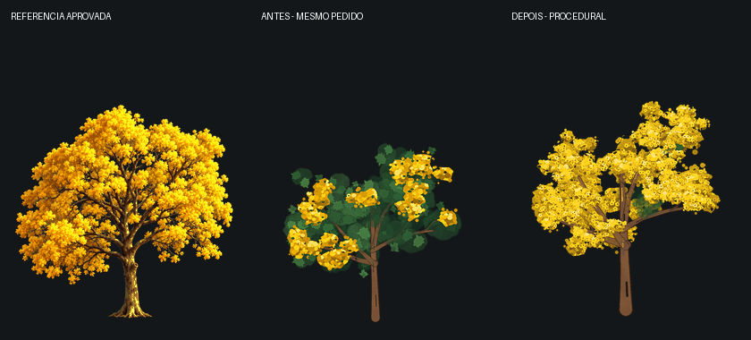

# Copa florida 2D: referência, comparação e limites

A referência selecionada é `examples/Ipê_amarelo/park_tree_ipe_amarelo_01_south.png`,
acompanhada do original detalhado `file_00000000a020820eb84754a936d70bf5.png`.
Esses arquivos permanecem intactos. O novo desenho é produzido pelo planejador,
com uma única estrutura e escala nas quatro direções, sem copiar o sprite aprovado.



## O que mudou

- A quantidade de flores e a retenção de folhas são controles separados. Uma copa
  intensamente florida pode ter poucos verdes sem perder a massa de fundo.
- A camada posterior usa flores, seguida de madeira e flores frontais. Assim os
  galhos permanecem legíveis entre massas conectadas de flores.
- O pincel `petalled` desenha cinco pétalas com miolo; o pincel `round` permanece
  disponível para receitas existentes. Os gradientes agora seguem cada grupo,
  em vez da altura do canvas inteiro.
- A cor pedida é respeitada, com sombras, meios-tons e luz derivados dela. Antes
  o ipê sempre recebia uma paleta fixa e outras espécies podiam ficar sem volume.
- O tronco e os ramos têm marcas de casca mais legíveis. O ipê tem estrutura mais
  alta e tronco mais espesso. O enquadramento usa uma escala compartilhada e
  reserva espaço para a base do tronco.
- O crítico separa dourado de madeira marrom, evitando interpretar flores como
  galhos expostos. Os limites dos testes de continuidade e recorte não mudaram.

## Comparação verificável

Foi executado o mesmo `plant_intent_ipe_reference_01.json` e seed no commit
`11adf5b` e no código novo. O código anterior ignorava `leafRetention` e a cor.
As medições dos dois resultados usam o crítico atual para tornar a comparação
consistente. Valores completos e hash da referência estão em
[quality/ipe_comparison.json](quality/ipe_comparison.json).

| Medida nas quatro direções | Antes | Depois |
|---|---:|---:|
| Pixels dourados na região da copa | 37,8–41,9% | 88,7–92,8% |
| Pixels verdes na região da copa | 54,7–58,9% | 0,5–2,7% |
| Menor margem do desenho ao canvas | 4 px | 11 px |
| Maior desequilíbrio lateral | 0,1534 | 0,0939 |
| Nota estrutural média, mesmas regras | 96,8 | 95,2 |
| Direções aprovadas pelos critérios estruturais | 4/4 | 4/4 |

A nota estrutural não aumentou: o ganho medido é a obediência à intenção de uma
copa amarela, com mais exposição de madeira e composição menos verde. A nota
não mede beleza nem semelhança artística. O sprite aprovado ainda tem casca,
raízes, ramificação e variedade de flores mais refinadas que o desenho novo.
O resultado procedural continua em revisão, sem aprovação artística automática.

## Reproduzir

```bash
a7-forge-2d plan-plant \
  --intent tools/visitor_forge_2d/examples/plant_intent_ipe_reference_01.json \
  --output out/ipe_reference
```

No JSON, `flowering.amount` controla abundância, `flowering.leafRetention`
controla folhagem de suporte e `flowering.color` aceita `#RRGGBB`. A nova receita
usa `amount: 0.96`, `leafRetention: 0.04` e `color: "#FFD21A"`.

A integração contínua renderiza as quatro direções e verifica pixels reais:
copa com pelo menos 70% de dourado, no máximo 10% de verde e todos os critérios
estruturais. Também publica os sprites, receitas, relatórios e o painel para
revisão. Esses limites são específicos do pedido de referência amarela,
não uma regra universal para todas as plantas.
