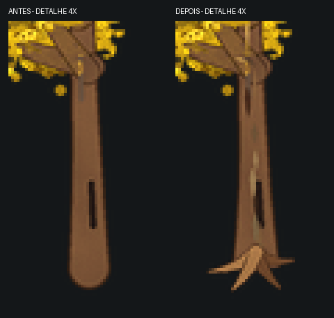

# Casca, raízes e estabilidade do desenho procedural

O próximo refinamento do ipê usa o mesmo pedido de referência amarela e compara
com o commit `6266aea`. Não modifica os PNGs artísticos aprovados.

## Alterações

- Placas de casca curtas, irregulares e afuniladas acompanham o tronco e os ramos.
  Usam detalhes vetoriais existentes, sem incluir ruído nas máscaras estruturais.
- Cinco raízes compartilham IDs e parâmetros em todas as vistas. A rotação
  acontece no plano do chão 2:1; os testes verificam essa transformação e a
  conexão entre raízes e tronco no raster.
- A geometria genérica aceita `startCap` e `endCap` com `round` ou `butt`. O
  tronco usa uma extremidade reta na base, com raízes desenhadas em seguida;
  receitas existentes mantêm extremidades arredondadas por padrão.
- Nós aleatórios podem declarar `seed` explicitamente. O compilador fixa os
  valores já escolhidos antes de inserir raízes. Isso evita que uma camada
  nova sorteie novamente todas as flores e texturas seguintes. O comportamento
  das receitas que não declaram esse campo permanece igual.
- O reparo ajusta os raios de todas as camadas de flores, inclusive a posterior.
  Ao mudar a escala da projeção, ajusta também raízes, tamanho dos pincéis,
  raios de flores e distância entre grupos. Antes, esses valores podiam ficar
  na escala anterior e invalidar o enquadramento ou a distribuição.
- Para abrir copas preenchidas demais, o reparo reduz a pintura e mantém a
  região original usada na avaliação. Encolher essa região podia aumentar a
  proporção medida de preenchimento, apesar de reduzir os grupos pintados.

## Validação e limites

O render real da referência mantém quatro vistas distintas e passa em todas
as verificações estruturais e de cor. Os resultados numéricos estão em
[quality/ipe_wood_comparison.json](quality/ipe_wood_comparison.json).

A nota estrutural média passou de 95,2 para 94,4; ela não mede o refinamento da
casca nem a qualidade artística das raízes. Nenhum limite do crítico foi
reduzido. A saída continua sendo um desenho procedural mais simples que a
referência artística.

Uma segunda seed com flores rosadas e abundância de 96% ainda pode produzir
copa excessivamente preenchida em duas vistas. O reparo ajusta corretamente
as duas camadas, mas só é aceito se não piorar nenhuma direção. Nesse caso,
o resultado continua sinalizado para revisão, em vez de receber aprovação
artística automática. Os controles de quantidade continuam necessários para
ajustar a composição de outras árvores.
