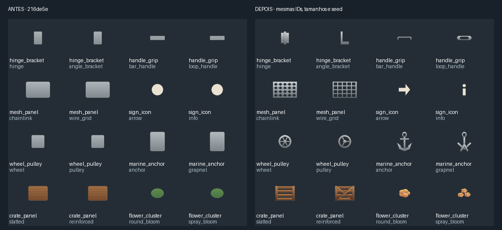

# Desenho geral: geometria, materiais e componentes

A galeria tem **704 variantes de componentes**, organizadas em **44 famílias**, dois estilos, quatro tamanhos e duas orientações. Isso não significa 704 assets completos: são peças para compor objetos e cenas. Todas as famílias agora têm construções semânticas; nenhuma é resolvida como um retângulo genérico apenas por ser `group`.



Comparação real com o commit `216de5e`, usando os mesmos IDs `md_000`, seed 43, escala 1.6, canvas 100×76, posição [50,38] e materiais padrão. Acabamento global desativado para inspecionar a construção. A prancha mostra oito famílias; a [galeria completa](quality/general_gallery_88_styles.png) e o [relatório](quality/general_gallery_report.json) cobrem os 88 estilos.

## O que mudou

- Formas com significado: âncoras, grades, rodas, puxadores, escadas, luminárias, ferragens, flores, arbustos, estruturas, sinalização e acabamento usam componentes geométricos próprios.
- Estilos alteram a construção: aro com raios versus polia, grades de malha versus grade ortogonal, caixote ripado versus reforçado, seta versus informação, entre outros.
- Os compositores de cena V1–V4 rotacionam o contorno real de retângulos, elipses, cápsulas e formas arredondadas. O desenho não vira o retângulo envolvente da peça rotacionada.
- Curvas e linhas escalam a espessura junto com o objeto. Em escala não uniforme, a largura usa a média geométrica dos eixos.
- `cutouts` subtrai formas fechadas da máscara, permitindo vazados transparentes. Limite: 32 recortes por forma, sem recortes aninhados.
- Sombras e relevos deslocam máscaras com preenchimento transparente. Pixels que saem de uma borda não reaparecem na borda oposta.
- Efeitos de superfície preservam o alfa do material e o acabamento V4 preserva a transparência. Contornos e sombras continuam podendo ampliar a silhueta explicitamente.
- Os materiais dos componentes usam degradês limitados à peça (`space: "object"`), dando contraste mesmo em detalhes pequenos. Materiais V3 existentes mantêm o padrão `space: "canvas"` para compatibilidade.
- A galeria acompanha o pacote instalado, sem depender da pasta `examples`. Os exemplos e a cópia empacotada são verificados para evitar divergência.

## Inspecionar e usar

```bash
python -m visitor_forge_2d.gallery_preview --output out/gallery
```

O comando produz a prancha, 88 PNGs transparentes individuais e um relatório com limites e proveniência. As imagens são geradas pelo compositor V4, sem substituição por imagens de IA.

Um nó em uma receita `CH_2D_SCENE_RECIPE_V4`:

```json
{
  "type": "component",
  "componentId": "marine_anchor_anchor_md_000",
  "material": "metal",
  "transform": {"translate": [64, 64], "scale": [2, 2], "rotateDeg": 25}
}
```

Um vazado em uma forma:

```json
{
  "type": "shape",
  "primitive": "ellipse",
  "box": [20, 20, 60, 60],
  "cutouts": [{"primitive": "ellipse", "box": [30, 30, 50, 50]}],
  "material": {"type": "solid", "color": "#86949A"}
}
```

## Verificação e limites

Testes percorrem a geometria de todas as 704 variantes, verificam limites e diferenças de construção dos estilos, além de rotação, escala, recortes, alfa e deslocamento de efeitos nos três compositores de base. A CI renderiza os 88 estilos com materiais reais e disponibiliza o resultado como artefato. O teste de instalação isolada renderiza uma âncora usando a galeria empacotada.

Os componentes são peças pequenas e determinísticas, ainda sujeitas a revisão artística. Composição, escala de gameplay, perspectiva, paleta e iluminação continuam sendo decisões da receita. Essas melhorias não convertem automaticamente qualquer comando livre em ilustração final, não substituem os renderizadores de personagem ou plantas e não aprovam assets para runtime (`artApproved: false`, `runtimePromotion: false`).
